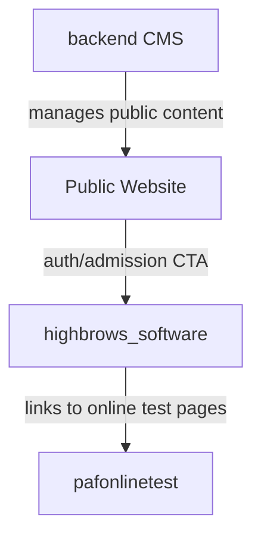

# `public_html` Function And Action Reference

## Purpose

This document is the technical companion to `PUBLIC_HTML_PRODUCT_DOCUMENTATION.md`.

Use this file when you need:

- controller and route understanding
- page/action mapping
- module-to-module relationships
- a clearer handoff for Figma AI workflow generation

Important note:

- For Laravel apps, controller methods and routes are documented from source files.
- For custom PHP apps, many "functions" are page-level actions rather than controller methods, so some descriptions are inferred from filenames and local code structure.

---

## 1. How To Read This Workspace

`public_html` contains multiple independent products. The safest way to understand it is:

1. Identify which product you are in
2. Identify whether it is page-based PHP or route/controller-based Laravel
3. Map the user role
4. Map the CRUD/action flow
5. Map external dependencies between products

Main products:

- Public website
- `backend` CMS
- `highbrows_software` school ERP
- `pafonlinetest` online test platform

---

## 2. Public Website Action Reference

### Nature of the module

This is a public-facing PHP website. It is not controller-driven. Each page is a standalone endpoint and often pulls content directly from database tables managed by `backend`.

### Shared files

| File | Responsibility | Relation |
|---|---|---|
| `Includes/Navbar.php` | global site navigation | links visitors into content pages and auth CTA |
| `Includes/footer.php` | global footer | shared public layout |

### Main pages and responsibilities

| Page | Responsibility | Depends On |
|---|---|---|
| `index.php` | home page and major content blocks | CMS content from `backend` tables |
| `about.php` | institutional/about content | CMS-managed about sections |
| `blog.php` | public blog listing | blog records from `backend` |
| `blog-details.php` | public blog detail page | selected blog record from `backend` |
| `contact.php` | contact form and institution contact display | contact save flow and CMS content |
| `team.php` | team/about-style presentation | public content records |
| `Lifestyle.php` | lifestyle/institution experience page | lifestyle CMS content |
| `Pricing.php` | pricing page | pricing content from CMS |
| `AdmissionFarm.php` | admissions-oriented landing page | public marketing + possible ERP CTA |
| `academic.php` | academic section | academic content and FAQs |
| `academic-program.php` | academic program detail | academic content |

### Public site relations

- Reads from `backend` database tables directly
- Sends users toward `highbrows_software` login/register flows
- Functions mainly as a marketing and discovery front end

### UX interpretation for Figma

Figma AI should treat these as:

- landing pages
- detail pages
- contact/admission CTA pages
- not internal dashboard screens

---

## 3. `backend` CMS Action Reference

### Architecture style

This is a page-based PHP CMS. Instead of one controller with methods, each content area has its own folder and its own action pages.

### Shared shell

| File | Responsibility |
|---|---|
| `Includes/sidebar.php` | navigation shell and topbar |
| `Includes/sidebar.css` | layout styling |
| `Includes/sidebar.js` | sidebar collapse/mobile behavior |
| `Index/index.php` | dashboard |

### Auth/Admin management

| File | Responsibility |
|---|---|
| `LoginReg/login.php` | admin login screen |
| `LoginReg/Signup.php` | create admin account |
| `LoginReg/Showadmin.php` | list/manage admin users |
| `LoginReg/Login-cruds/*` | login/signup/logout processing |

### CRUD pattern by module

Most CMS modules follow this structure:

- `add_*` or `insert_*`: create form or create action
- `show_*` or `view_*`: listing screen
- `edit_*`: edit form/update entry point
- `delete_*`: delete action
- `submit_*`: final save for media/content forms

### CMS modules

| Module Folder | Business Purpose | Typical Actions | Public Site Dependency |
|---|---|---|---|
| `Index/BlogsContent` | blog management | add, edit, submit, view, delete | `blog.php`, `blog-details.php` |
| `Index/HeroAreas` | homepage hero content | insert, submit, show, edit, delete | `index.php` |
| `Index/AboutSection` | about page blocks | add, show, edit, delete | `about.php` |
| `Index/AcademicFaqs` | FAQ content | add, show, edit, delete | `academic.php` |
| `Index/LifeStyle` | lifestyle content | add, show, edit, delete | `Lifestyle.php` |
| `Index/ReviewsContent` | editorial testimonials/reviews | add, show, edit, delete | review sections on public site |
| `Index/UserReviews` | user-submitted reviews | add, show, edit, delete | review display |
| `Index/GalleryProudMoment` | proud/gallery moments | insert, show, edit, delete | gallery sections |
| `Index/CadetMoments` | cadet-related gallery/media | add, view, edit, delete | cadet/public media blocks |
| `Index/MilitaryMoments` | military gallery/media | add, show, edit, delete | military/public media blocks |
| `Index/OurSevices` | services content | add, show, edit, delete | service sections |
| `PricingManage` | pricing plans/cards | add, show, edit, delete | `Pricing.php` |
| `ContactUs` | contact records | view, remove, insert | `contact.php` |
| `ExploreHighbrows` | institutional exploration content | add, show, edit, delete | public pages |
| `ExploreHighbrows2` | second institutional exploration section | add, show, edit, delete | public pages |

### Functional meaning of page names

When documenting this system for design, map these page types consistently:

- "add" page = creation form
- "show/view" page = list/table/grid of entries
- "edit" page = edit form
- "delete" page = destructive action, often immediate
- "submit/insert" page = save-processing or upload-processing step

### Relations

- `backend` is the content source for the public website
- It should be considered a separate product from `highbrows_software`
- It is mainly a content CRUD admin with media handling

---

## 4. `highbrows_software` School ERP Function Reference

### Architecture style

This is the main Laravel role-based application in the workspace. It uses:

- `routes/web.php`
- controller classes
- models and relationships
- Blade views
- separate role sidebars

### Core roles

- `admin`
- `subadmin`
- `cordinator`
- `student`

### Route groups and product meaning

| Route Area | Meaning |
|---|---|
| auth routes | signup/login/logout |
| admin dashboard routes | main operational summary |
| admissions/students | registration, admission records, student lifecycle |
| academic setup | classes, subjects, colleges |
| attendance | student and employee attendance |
| finance | fees, monthly fees, expenses, salaries |
| exams/results | exams, schedules, datesheets, results |
| blogs | internal blog CRUD |
| rules | student/teacher policy content |
| role dashboards | subadmin, coordinator, student |

### Controller-to-function mapping

#### `AdminController`

| Function | Responsibility | Related Area |
|---|---|---|
| `login` | role-based login/landing logic | auth, access routing |

#### `LoginController`

| Function | Responsibility | Related Area |
|---|---|---|
| `showsignup` | render signup page | auth |
| `showlogin` | render login page | auth |
| `signup` | process registration | auth |
| `login` | process login | auth |
| `authenticated` | post-login role behavior | auth |

#### `DashboardController`

| Function | Responsibility | Related Area |
|---|---|---|
| `__construct` | middleware/setup | dashboard protection |
| `index` | admin dashboard summary | admin dashboard |
| `students` | student count/report feed | dashboard analytics |
| `showIncome` | income/revenue summary | finance dashboard |

#### `AdmissionController`

| Function | Responsibility | Related Area |
|---|---|---|
| `__construct` | setup/middleware | admissions |
| `index` | admissions list | admissions |
| `showRegistrationForm` | initial student user registration form | student onboarding |
| `updateUser` | update linked user/account info | profile/account |
| `create` | full admission form screen | admissions |
| `store` | save admission record | admissions |
| `show` | show admission/student detail | student profile |
| `edit` | edit admission record | admissions |
| `editUser` | edit linked user/account form | profile/account |
| `update` | save admission updates | admissions |
| `destroy` | delete admission | destructive admin action |
| `print` | printable admission/profile record | print/export |

Important relation:

- user registration and admission data are separate but connected
- this is why the admission flow feels split across multiple screens

#### `StudentController`

| Function | Responsibility | Related Area |
|---|---|---|
| `index` | students listing | student management |
| `create` | create student screen | student management |
| `store` | save student | student management |
| `show` | student detail view | student profile |
| `edit` | edit student | student management |
| `update` | save changes | student management |
| `destroy` | delete student | destructive admin action |

#### `TeachersController`

| Function | Responsibility | Related Area |
|---|---|---|
| `index` | teachers list | teacher management |
| `create` | add teacher form | teacher onboarding |
| `store` | save teacher | teacher onboarding |
| `show` | teacher detail | teacher management |
| `edit` | edit teacher | teacher management |
| `update` | save teacher updates | teacher management |
| `destroy` | delete teacher | destructive admin action |

#### `SubAdminController`

| Function | Responsibility | Related Area |
|---|---|---|
| `SubAdmin` | subadmin list/index | staff/admin management |
| `createSubAdmin` | add subadmin form | subadmin onboarding |
| `store` | save subadmin | subadmin onboarding |
| `edit` | edit subadmin | subadmin management |
| `update` | save subadmin changes | subadmin management |
| `destroy` | delete subadmin | destructive admin action |
| `dashboard` | subadmin dashboard | role dashboard |
| `subAdminProfile` | subadmin profile view | role profile |

#### `CordinatorController`

| Function | Responsibility | Related Area |
|---|---|---|
| `index` | coordinator list | staff management |
| `create` | add coordinator | staff onboarding |
| `store` | save coordinator | staff onboarding |
| `show` | coordinator detail | staff management |
| `edit` | edit coordinator | staff management |
| `update` | save coordinator updates | staff management |
| `destroy` | delete coordinator | destructive action |
| `dashboard` | coordinator dashboard | role dashboard |

#### `CordinatorDashboard`

| Function | Responsibility | Related Area |
|---|---|---|
| `index` | coordinator landing dashboard | role dashboard |

#### `ClassesController`

| Function | Responsibility | Related Area |
|---|---|---|
| `index` | class list | academic setup |
| `create` | add class form | academic setup |
| `store` | save class | academic setup |
| `show` | class detail | academic setup |
| `edit` | edit class | academic setup |
| `update` | save class changes | academic setup |
| `destroy` | delete class | academic setup |

#### `SubjectController`

| Function | Responsibility | Related Area |
|---|---|---|
| `index` | subject list | academic setup |
| `create` | add subject form | academic setup |
| `store` | save subject | academic setup |
| `show` | subject detail | academic setup |
| `edit` | edit subject | academic setup |
| `update` | save subject changes | academic setup |
| `destroy` | delete subject | academic setup |

#### `CollegesController`

| Function | Responsibility | Related Area |
|---|---|---|
| `index` | college list | cadet college setup |
| `create` | add college form | cadet college setup |
| `store` | save college | cadet college setup |
| `show` | college detail | cadet college setup |
| `edit` | edit college | cadet college setup |
| `update` | save college changes | cadet college setup |
| `destroy` | delete college | cadet college setup |

#### `AttendanceController`

| Function | Responsibility | Related Area |
|---|---|---|
| `studentattendance` | attendance landing/index | attendance |
| `addStudentAttendanceView` | show add attendance screen | attendance entry |
| `studentAttendanceStore` | save student attendance | attendance entry |
| `studentAttendanceView` | attendance list | attendance review |
| `filterAttendance` | filter attendance records | attendance review |
| `viewAttendance` | more detailed attendance view | attendance review |
| `showStudentAttendance` | single-student attendance history | student detail |

#### `EmployeeAttendanceController`

| Function | Responsibility | Related Area |
|---|---|---|
| `employeeAttendanceView` | employee attendance list | staff attendance |
| `showEmployeeAttendance` | single employee attendance history | staff attendance |
| `addAttendanceView` | add employee attendance form | staff attendance entry |
| `employeeAttendanceStore` | save employee attendance | staff attendance entry |
| `TeacherAttendanceView` | teacher-focused attendance view | staff attendance |
| `filterAttendance` | filter employee attendance | staff attendance review |

#### `FeesController`

| Function | Responsibility | Related Area |
|---|---|---|
| `__construct` | setup/middleware | fees |
| `index` | fee records list | finance |
| `create` | create fee/challan setup | finance |
| `store` | save fee setup | finance |
| `feeDetails` | installment/fee detail drilldown | finance detail |
| `show` | fee detail screen | finance detail |
| `edit` | edit fee record | finance |
| `update` | update fee or payment status | finance |
| `uploadReceipt` | upload payment proof/receipt | payment workflow |
| `destroy` | delete fee | finance |
| `generateChallan` | challan print/export | print/export |
| `generateReceipt` | receipt print/export | print/export |

#### `MonthlyFees`

| Function | Responsibility | Related Area |
|---|---|---|
| `index` | monthly fee list | monthly fee admin |
| `create` | create monthly fee form | monthly fee admin |
| `store` | save monthly fee record | monthly fee admin |
| `generateForCurrentMonth` | bulk-generate current month fees | finance automation |
| `show` | monthly fee detail | monthly fee admin |
| `edit` | edit monthly fee | monthly fee admin |
| `update` | save changes | monthly fee admin |
| `destroy` | delete monthly fee | monthly fee admin |
| `studentdetails` | fetch student data for fee generation | supporting lookup |
| `pay` | payment screen/action | payment workflow |
| `markAsPaid` | confirm payment status | payment workflow |

#### `StudentMonthlyFee`

| Function | Responsibility | Related Area |
|---|---|---|
| `index` | student-side monthly fee listing | student portal |
| `feeDetails` | student-side fee detail | student portal |
| `uploadReceipt` | student uploads receipt | student payment workflow |
| `statusupdated` | status update display/handling | student payment workflow |
| `statusupdate` | status update action | student payment workflow |

#### `ExpenseController`

| Function | Responsibility | Related Area |
|---|---|---|
| `index` | expense list | finance |
| `create` | add expense form | finance |
| `store` | save expense | finance |
| `edit` | edit expense | finance |
| `update` | save expense update | finance |
| `uploadReceipt` | attach receipt | finance document flow |
| `destroy` | delete expense | finance |

#### `SalariesController`

| Function | Responsibility | Related Area |
|---|---|---|
| `index` | salary list | payroll |
| `createForCurrentMonth` | bulk generate current month salary records | payroll |
| `paySalary` | mark/pay salary | payroll |
| `generateReceipt` | salary receipt export | payroll print/export |

#### `ExamController`

| Function | Responsibility | Related Area |
|---|---|---|
| `index` | exam list | exams |
| `create` | add exam form | exams |
| `store` | save exam | exams |
| `show` | exam detail | exams |
| `edit` | edit exam | exams |
| `update` | save exam update | exams |
| `destroy` | delete exam | exams |

#### `ExamScheduleController`

| Function | Responsibility | Related Area |
|---|---|---|
| `index` | exam schedule list | exam operations |
| `create` | add schedule form | exam operations |
| `store` | save schedule | exam operations |
| `destroy` | delete schedule | exam operations |
| `edit` | edit schedule form | exam operations |
| `updateschedule` | save schedule changes | exam operations |
| `datesheetview` | open datesheet creation view | exam operations |
| `datesheet` | store datesheet | exam operations |
| `datesheetlist` | list datesheet entries | exam operations |
| `datedel` | delete datesheet row | exam operations |
| `dateedit` | edit datesheet row | exam operations |
| `dateupdateschedule` | update datesheet | exam operations |
| `resultPrint` | print result/schedule summary | print/export |

#### `ResultController`

| Function | Responsibility | Related Area |
|---|---|---|
| `index` | result landing page | results |
| `add` | add result form | result entry |
| `store` | save marks/result | result entry |
| `determineGrade` | grade calculation logic | result processing |
| `list` | result list | result review |
| `view` | single result view | result review |
| `showResultCard` | result card display | student/print output |
| `notFound` | fallback when result missing | error state |

#### `Questions`

| Function | Responsibility | Related Area |
|---|---|---|
| `index` | question list | question bank |
| `create` | add question form | question bank |
| `edit` | edit question form | question bank |
| `update` | save question changes | question bank |
| `destroy` | delete question | question bank |
| `store` | save question | question bank |

#### `BlogsController`

| Function | Responsibility | Related Area |
|---|---|---|
| `index` | blog list | content/blog |
| `create` | add blog form | content/blog |
| `store` | save blog | content/blog |
| `show` | blog detail | content/blog |
| `edit` | edit blog | content/blog |
| `update` | save blog changes | content/blog |
| `destroy` | delete blog | content/blog |

#### `StudentDashboard`

| Function | Responsibility | Related Area |
|---|---|---|
| `index` | student dashboard | student portal |
| `profile` | student profile | student portal |
| `userResult` | student results | student portal |
| `userAttendance` | student attendance | student portal |
| `showStudentAttendance` | detailed attendance history | student portal |

#### `TeacherRules`

| Function | Responsibility | Related Area |
|---|---|---|
| `index` | rule list | policy content |
| `create` | add rule form | policy content |
| `store` | save rule | policy content |
| `show` | rule detail | policy content |
| `edit` | edit rule | policy content |
| `update` | save rule changes | policy content |
| `destroy` | delete rule | policy content |

#### `StudentRules`

| Function | Responsibility | Related Area |
|---|---|---|
| `index` | rule list | policy content |
| `create` | add rule form | policy content |
| `store` | save rule | policy content |
| `show` | rule detail | policy content |
| `edit` | edit rule | policy content |
| `update` | save rule changes | policy content |
| `destroy` | delete rule | policy content |

#### `ContactController`

| Function | Responsibility | Related Area |
|---|---|---|
| `store` | save public contact form into system | public-to-admin bridge |

#### `TestController`

| Function | Responsibility | Related Area |
|---|---|---|
| `generate` | generate test | testing |
| `submit` | submit test | testing |

Note:

- `routes/web.php` points to `generateTest` and `submitTest`, while the controller extraction shows `generate` and `submit`.
- This suggests either renamed methods or route/controller mismatch.
- This should be verified before redesigning the test flow.

### Route mismatch notes worth validating

The current route file appears to reference some methods that do not exist in the inspected controllers:

- `AdmissionController::storeUser`
- `AttendanceController::attendanceClass`
- `StudentDashboard::form`
- `TestController::generateTest`
- `TestController::submitTest`

Practical meaning:

- some flows may be partially broken
- some methods may have been renamed without updating routes
- some UX screens may exist in design intent but not fully in working code

For Figma AI, keep these flows in scope as product requirements, but do not assume the current implementation is fully aligned.

### Main entity relations

| Entity | Related To | Meaning |
|---|---|---|
| `User` | `Admission`, `Teacher`, `MonthlyFee` | master identity record |
| `Admission` | `User`, `Clase`, `College` | student admission lifecycle |
| `Clase` | `Teacher`, `Subject`, `Admission` | academic grouping |
| `Teacher` | `User`, `Clase`, `Salarie`, `EmployeeAttendance` | staff lifecycle |
| `Fee` | student/admission/installments | institutional fee plan |
| `MonthlyFee` | student/user/details | recurring billing |
| `Exam` | schedule, datesheet, result | exam lifecycle |
| `Result` | student, class, subject, exam | academic outcome |

### Product relation summary

- Public site sends users into this app for login/register
- This app has the most important operational workflows
- It is the main admin UX redesign target in the workspace

---

## 5. `pafonlinetest` Function And Page Reference

### Architecture style

This is a page-based custom PHP online exam system.

Functions are expressed as pages and action scripts, not Laravel-style controllers.

### Main roles

- admin
- candidate/user

### Admin pages and responsibilities

| File | Responsibility | Relation |
|---|---|---|
| `login.php` | admin login screen | auth |
| `admin1_pannel.php` | admin dashboard | admin home |
| `header.php` | admin navigation shell | links major test actions |
| `add_test.php` | add test form | test setup |
| `show_test.php` | test list/edit/delete | test management |
| `add-subject.php` | add subject under a test | subject setup |
| `show-subject.php` | subject list/edit/delete | subject management |
| `add-questions.php` | add question(s) | question management |
| `show-question.php` | list/filter/edit/delete questions | question management |
| `show-users.php` | list candidate users | candidate management |
| `show_user_answers.php` | inspect saved answers | answer review |
| `show-users-result.php` | result list by user | result review |

### Admin action scripts

| File | Responsibility |
|---|---|
| `insert_test.php` | save new test |
| `update_test.php` | update test |
| `insert_subjects.php` | save subject |
| `insert_questions.php` | save questions |
| `save_question.php` | save a question record |
| `update_question.php` | update question |
| `delete_question.php` | delete one question |
| `delete_all_questions.php` | bulk-delete questions |
| `delete_useres.php` | delete one user |
| `delete_all_users.php` | bulk-delete users |
| `fetch_results.php` | load result data |
| `reschedule_test.php` | reschedule test timing/state |
| `reset_test.php` | reset test/attempt state |

### Candidate/user pages

| File | Responsibility | Relation |
|---|---|---|
| `register.php` | candidate signup form | user onboarding |
| `register_process.php` | save registration | user onboarding |
| `userlogin.php` | candidate login | auth |
| `index.php` | candidate landing/dashboard | test access |
| `test.php` | exam-taking UI | active test |
| `test_process.php` | test loading/submission logic | active test |
| `save_answer.php` | save candidate answer | active test |
| `display_result.php` | show final result | candidate outcome |
| `userlogout.php` | user logout | auth |

### AJAX/support endpoints

| File | Responsibility |
|---|---|
| `get_tests.php` | fetch test list |
| `get_subjects.php` | fetch subjects |
| `get_subjects_by_test.php` | filter subjects by test |
| `load_subjects.php` | dynamic subject loading |
| `load_questions.php` | dynamic question loading |
| `get_subject_results.php` | result data by subject |

### Data relation summary

This system appears to follow this structure:

- test
- subject belongs to test
- question belongs to subject
- user attempts test
- answers belong to user and question
- result belongs to user/test context

### Figma workflow interpretation

Design these flows:

1. Admin creates test
2. Admin attaches subjects
3. Admin loads questions
4. Candidate registers/logs in
5. Candidate attempts test
6. System saves answers progressively
7. Candidate/admin view results

---

## 6. Cross-Product Relation Map

### Practical meaning

- `backend` and the public site are tightly coupled
- `highbrows_software` is the main operational system
- `pafonlinetest` is related by workflow, not by shared shell

---

## 7. Best Way To Give This To Figma AI

Provide both documents together:

1. `PUBLIC_HTML_PRODUCT_DOCUMENTATION.md`
2. `PUBLIC_HTML_FUNCTION_REFERENCE.md`

Ask Figma AI to use:

- the product document for structure, boundaries, roles, and entities
- the function reference for workflow and screen/action understanding

### Recommended instruction

Use this kind of prompt:

> Use the attached documentation to redesign the systems as separate but related products. Keep modules separate, preserve real user roles, and create workflows based on the documented controller/page actions. Prioritize admissions, student lifecycle, staff lifecycle, finance, exam operations, and test management. Where current code shows split or confusing flows, redesign them into clearer step-by-step UX journeys rather than copying the old layout directly.

---

## 8. Best Next Documentation Step

If you want an even stronger Figma handoff after this, the next document should be:

- screen-by-screen inventory for `highbrows_software`
- screen-by-screen inventory for `pafonlinetest`
- component inventory for tables, forms, dashboards, filters, and print views

That would let Figma AI generate much more accurate admin flows and wireframes.
