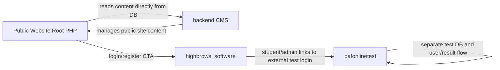

# `public_html` Product And Module Documentation

## Purpose

This document explains the major products, panels, roles, screens, entities, and module relationships inside `public_html`.

It is written for:

- UX redesign work
- Figma AI handoff
- product mapping
- admin panel redesign planning

It intentionally focuses on application logic and module behavior, not vendor libraries, `node_modules`, `vendor`, uploaded media, or framework internals.

---

## 1. Workspace Summary

`public_html` is not one application. It is a workspace containing multiple separate systems:

1. Public marketing website for HighBrows
2. Custom PHP backend CMS for website content management
3. Laravel-based school/ERP panel with admin, subadmin, coordinator, teacher, and student workflows
4. PAF online test system with admin and user/test-taking sides
5. Some duplicate or archive folders

### Important design implication

For UX work, these systems should be treated as separate products with different user goals, not as one single admin panel.

---

## 2. Top-Level Module Map

| Module | Type | Purpose | Primary Users |
|---|---|---|---|
| `/` root PHP pages | Public website | Marketing, admissions, blog, public content | visitors, parents, students |
| `backend` | Custom PHP CMS | Manage website content shown on public site | admins |
| `highbrows_software` | Laravel ERP/panel | Student management, admissions, teachers, fees, exams, attendance, roles | admin, subadmin, coordinator, student |
| `pafonlinetest` | Custom PHP test system | Build tests, subjects, questions, users, results, exam attempt flow | test admin, test users |
| `pafsoftware` | PHP test system | Appears to be a duplicate/alternate copy of `pafonlinetest` | internal/legacy |
| `database-connection` | SQL assets | Database dump(s) for content-side system | developers/admins |
| `Mudassir` | Static HTML | Standalone/static content pages | visitors |
| `msphere` | Archive ZIP | Packed asset/app archive | internal |
| `Spare_admin` | Archive/placeholder | spare or nested admin copy | internal |

---

## 3. High-Level Relationship Diagram

---

## 4. Public Website Module

### Location

- Root PHP pages in `public_html`
- Shared includes in `Includes`
- CSS in `styles` and `assets`

### Main Purpose

This is the public-facing HighBrows website for marketing, institutional information, admissions messaging, blog content, and contact/discovery flows.

### Main Public Pages

| File | Purpose |
|---|---|
| `index.php` | Homepage |
| `about.php` | About page |
| `blog.php` | Blog listing |
| `blog-details.php` | Blog detail page |
| `contact.php` | Contact page |
| `team.php` | Team page |
| `Lifestyle.php` | Lifestyle content page |
| `Pricing.php` | Pricing page |
| `AdmissionFarm.php` | Admission landing/form-related page |
| `academic.php` | Academic section |
| `academic-program.php` | Academic program detail |

### Shared Layout Files

| File | Purpose |
|---|---|
| `Includes/Navbar.php` | Global website navigation |
| `Includes/footer.php` | Global footer |

### Data Dependency

The public website is tightly coupled to the custom CMS in `backend`.

It directly includes the backend DB connection and queries CMS tables from public pages.

Examples:

- `index.php` reads `heroareas` and other public content from backend-managed tables
- `about.php` includes backend DB multiple times for dynamic sections
- `blog.php` and `blog-details.php` read blog content managed by backend

### Primary Public Content Sources

Based on `database-connection/highbrows_db.sql`, the public website uses CMS tables like:

- `heroareas`
- `blogs_content`
- `academic_faqs`
- `contact_users`
- `explore_highbrows`
- `explore_highbrows2`
- `cadet_moments`
- pricing/reviews/gallery/about-related tables

### Cross-System Links

- Navbar login/register CTA points to school panel auth in `highbrows_software`
- Public site content depends on `backend` data

### UX Notes For Figma

- Treat this as a marketing and discovery site
- It needs visitor-focused navigation, not admin-style navigation
- Content blocks should be editable from CMS but visually unified on public pages

---

## 5. `backend` Custom PHP CMS

### Location

- `backend`

### Purpose

This is the website content management system used to manage public website content.

### Primary User

- Admin

### Core Layout Files

| File | Purpose |
|---|---|
| `Includes/sidebar.php` | Left navigation + topbar shell |
| `Includes/sidebar.css` | CMS layout styling |
| `Includes/sidebar.js` | sidebar collapse/mobile behavior |
| `Index/index.php` | dashboard |

### Auth Module

| File/Folder | Purpose |
|---|---|
| `LoginReg/login.php` | admin login screen |
| `LoginReg/Signup.php` | create admin user |
| `LoginReg/Showadmin.php` | manage admin users |
| `LoginReg/Login-cruds` | login/signup/logout handlers |

### CMS Module Pattern

Most backend content modules follow the same CRUD structure:

- `add_*.php` or `insert_*.php`
- `show_*.php` or `view_*.php`
- `edit_*.php`
- `delete_*.php`

### Main Content Modules

| Folder | Business Meaning | Typical Files |
|---|---|---|
| `Index/BlogsContent` | public blog content | add, view, edit, delete, submit |
| `Index/HeroAreas` | homepage hero images/videos | insert, show, edit, delete, submit |
| `Index/AboutSection` | about page section content | add, show, edit, delete |
| `Index/AcademicFaqs` | FAQ content | add, show, edit, delete |
| `Index/LifeStyle` | lifestyle page content | add, show, edit, delete |
| `Index/ReviewsContent` | official/admin review content | add, show, edit, delete |
| `Index/UserReviews` | user-submitted reviews/content | add, show, edit, delete |
| `Index/GalleryProudMoment` | gallery items | insert/show/edit/delete |
| `Index/CadetMoments` | cadet gallery content | add/show/edit/delete |
| `Index/MilitaryMoments` | military gallery content | add/show/edit/delete |
| `Index/OurSevices` | services section | add/show/edit/delete |
| `PricingManage` | pricing cards/plans | add/show/edit/delete |
| `ContactUs` | visitor contacts/messages | view/delete/insert |
| `ExploreHighbrows` | pre-cadet content | add/show/edit/delete |
| `ExploreHighbrows2` | force academy content | add/show/edit/delete |

### Database Ownership

This CMS owns the content that the public site reads directly.

### Functional Summary

#### Dashboard

- shows counts of content modules
- links admins into CMS sections

#### Admin User Management

- create admin account
- list admins
- delete admin

#### Content Management

- upload images
- edit titles/descriptions
- manage blog rich text
- manage hero media
- manage reviews and galleries

#### Contact Management

- view contact submissions
- remove contact records

### Relationship To Public Site

This CMS is the source of truth for large portions of the public website content.

### Figma AI UX Interpretation

Treat `backend` as:

- a lightweight content CMS
- primarily list + form + media upload workflows
- not a school ERP
- not an exam engine

The correct redesign goal is:

- faster content publishing
- clearer content grouping
- better image/media handling
- reusable list/search/filter patterns

---

## 6. `highbrows_software` School ERP / Main Role-Based Panel

### Location

- `highbrows_software`

### Purpose

This is the main role-based operational panel for the institution.

It handles:

- admissions
- student records
- teacher records
- subadmin/coordinator roles
- class and subject setup
- fees and monthly fees
- exams, schedules, datesheets, results
- student and employee attendance
- blogs
- expenses

### Roles Found In UI Logic

- `admin`
- `subadmin`
- `cordinator`
- `student`

These role checks appear repeatedly in Blade templates and decide which sidebar and pages the user sees.

### Primary Entry Files

| File | Purpose |
|---|---|
| `routes/web.php` | main route map |
| `resources/views/admin/index.blade.php` | role-based admin shell |
| `resources/views/admin/nav.blade.php` | top navbar |
| `resources/views/admin/sidebar.blade.php` | admin navigation |
| `resources/views/subadmin/sidebar.blade.php` | subadmin navigation |
| `resources/views/cordinator/sidebar.blade.php` | coordinator navigation |
| `resources/views/student/sidebar.blade.php` | student navigation |

### Main Domain Entities

From models and migrations, the key business entities are:

- `User`
- `Admission`
- `Student`
- `Document`
- `College`
- `Clase`
- `Subject`
- `ClassesSubject`
- `Teacher`
- `StudentAttendance`
- `EmployeeAttendance`
- `Fee`
- `Installment`
- `MonthlyFee`
- `MonthlyFeeDetail`
- `Exam`
- `ExamSchedule`
- `DateSheet`
- `Result`
- `Blog`
- `Expense`
- `Salarie`
- `StudentCondition`
- `EmployeeCondition`

### Core Relationships

#### User relationships

- A `User` can have admissions
- A `User` can have teacher records
- A `User` can have monthly fee records

#### Admission relationships

- An `Admission` belongs to a class/grade
- An `Admission` belongs to a user
- An `Admission` can have many cadet colleges

#### Class relationships

- A `Clase` has many subjects through `ClassesSubject`
- A `Clase` has a teacher
- A `Clase` has admissions/students

#### Teacher relationships

- A `Teacher` belongs to a `User`
- A `Teacher` can have classes
- A `Teacher` can have salaries
- A `Teacher` can have attendance records

#### Fee relationships

- `Fee` belongs to student/admission context
- `Fee` has installments

#### Monthly fee relationships

- `MonthlyFee` has `MonthlyFeeDetail`
- `MonthlyFee` links to student/user data

#### Exam relationships

- `Exam` has schedules
- `ExamSchedule` belongs to class, subject, and exam
- `DateSheet` belongs to exam schedule and subject
- `Result` links student, subject, class, and exam

### Main Functional Areas

#### A. Dashboard

- income
- expenses
- revenue
- student count
- teacher/employee count
- month/year filtering

Primary files:

- `app/Http/Controllers/DashboardController.php`
- `resources/views/admin/main.blade.php`

#### B. Student Registration And Admission

Two related flows exist:

1. Register a user account
2. Fill full admission record

Key files:

- `resources/views/admin/register-student.blade.php`
- `resources/views/admin/add-student.blade.php`
- `resources/views/admin/student-list.blade.php`
- `resources/views/admin/students.blade.php`

This flow is central for UX redesign because it contains:

- account registration
- long admission form
- document uploads
- cadet college selection
- admission viewing/editing

#### C. Teacher And Staff Management

There are two related role tracks:

- teacher records
- subadmin records

Key files:

- `app/Http/Controllers/TeachersController.php`
- `app/Http/Controllers/SubAdminController.php`
- `resources/views/admin/viewall-employees.blade.php`
- `resources/views/subadmin/add-subadmin.blade.php`
- `resources/views/admin/add-teacher.blade.php`

Important product note:

This area currently mixes teacher registration and subadmin management in confusing ways. For UX/Figma, model them as separate entities.

#### D. Academic Setup

- class creation
- subject creation
- class-subject assignment
- college management

Key controllers:

- `ClassesController`
- `SubjectController`
- `CollegesController`

#### E. Attendance

- student attendance entry
- student attendance viewing/filtering
- employee attendance entry
- employee attendance viewing/filtering

Key controllers:

- `AttendanceController`
- `EmployeeAttendanceController`

#### F. Fees And Finance

- cadet college fees
- installments
- challan generation
- receipt upload
- monthly fees
- expense management
- salary management

Key controllers:

- `FeesController`
- `MonthlyFees`
- `StudentMonthlyFee`
- `ExpenseController`
- `SalariesController`

#### G. Exam And Result System

- exam creation
- exam schedules
- datesheets
- marks/result entry
- result listing
- result view/print

Key controllers:

- `ExamController`
- `ExamScheduleController`
- `ResultController`

#### H. Role-Specific Student Panel

Student users can:

- view dashboard
- view profile
- edit profile
- view result
- view attendance
- view fee record
- access external online exam login

#### I. Rules / Terms / Conditions

- student rules
- teacher/employee rules

Controllers:

- `StudentRules`
- `TeacherRules`

### Controller Reference

#### AdminController

- `login`: handles role-based landing behavior

#### AdmissionController

- `index`: admissions list
- `showRegistrationForm`: show registration-related entry form
- `updateUser`: update user profile/account data
- `create`: show admission form
- `store`: create admission
- `show`: show admission/student detail
- `edit`: edit admission
- `editUser`: edit user profile/account data
- `update`: update admission
- `destroy`: delete admission
- `print`: printable admission record

#### AttendanceController

- `studentattendance`: attendance landing page
- `addStudentAttendanceView`: open attendance add screen
- `studentAttendanceStore`: save student attendance
- `studentAttendanceView`: list student attendance
- `filterAttendance`: filter attendance
- `viewAttendance`: detailed attendance view
- `showStudentAttendance`: per-student attendance history

#### BlogsController

- standard CRUD for blogs

#### ClassesController

- standard CRUD for classes

#### CollegesController

- standard CRUD for colleges

#### ContactController

- `store`: save public contact form data

#### CordinatorController

- CRUD for coordinator records plus dashboard

#### DashboardController

- `index`: main dashboard
- `students`: student count/report data
- `showIncome`: financial summary data

#### EmployeeAttendanceController

- employee attendance add/view/filter/detail flows

#### ExamController

- standard exam CRUD

#### ExamScheduleController

- schedule CRUD
- datesheet CRUD
- result print view

#### ExpenseController

- expense list/create/store/edit/update/delete
- receipt upload

#### FeesController

- fee list/create/store/show/edit/update/delete
- fee detail drilldown
- challan generation
- receipt generation
- receipt upload

#### LoginController

- `showsignup`, `showlogin`, `signup`, `login`, `authenticated`

#### MonthlyFees

- monthly fee generation, listing, create, edit, pay, mark paid, student detail lookup

#### Questions

- question bank CRUD

#### ResultController

- result entry
- grade determination
- result list
- result view
- result card
- not found screen

#### SalariesController

- salary list
- generate salary for current month
- salary payment
- salary receipt

#### StudentController

- student account CRUD

#### StudentDashboard

- student-side dashboard/profile/result/attendance flows

#### StudentMonthlyFee

- student-side monthly fee list/detail/upload/status behavior

#### StudentRules / TeacherRules

- rules CRUD

#### SubAdminController

- subadmin list/create/edit/delete/dashboard/profile

#### SubjectController

- subject CRUD

#### TeachersController

- teacher CRUD

#### TestController

- test generation and submission

### Figma AI UX Interpretation

Treat this as a school ERP with multiple role dashboards.

Design should be split into:

1. Admin operations
2. Staff management
3. Student lifecycle
4. Finance
5. Exams and outcomes
6. Role-specific student portal

This is the best candidate for a full design system and redesign.

---

## 7. `pafonlinetest` Online Test System

### Location

- `pafonlinetest`

### Purpose

Standalone online testing platform with:

- admin side
- candidate/user side
- question bank
- result calculation
- PDF result export

### Primary Users

- Test admin
- Test candidate / registered user

### Core Data Model

The system logic shows this approximate relation:

- `tests`
  - has many `subjects`
    - has many `questions`
- `useres`
  - submits `answers`
  - receives `results`

### Main Admin Files

| File | Purpose |
|---|---|
| `login.php` | admin login |
| `admin1_pannel.php` | admin dashboard |
| `header.php` | admin sidebar navigation |
| `add_test.php` | create test |
| `show_test.php` | list/edit/delete tests |
| `add-subject.php` | create subject under test |
| `show-subject.php` | list/edit/delete subjects |
| `add-questions.php` | bulk/manual question creation |
| `show-question.php` | filter, edit, delete questions |
| `show-users.php` | list users and actions |
| `show_user_answers.php` | review answers |
| `show-users-result.php` | grouped result list |

### Main Candidate/User Files

| File | Purpose |
|---|---|
| `register.php` | user registration |
| `register_process.php` | registration processing |
| `userlogin.php` | candidate login |
| `index.php` | likely user dashboard/test home |
| `test.php` | test page |
| `test_process.php` | load/process test data |
| `save_answer.php` | save answer |
| `display_result.php` | user result display |

### Supporting Admin Action Files

- `insert_test.php`
- `update_test.php`
- `insert_subjects.php`
- `insert_questions.php`
- `save_question.php`
- `update_question.php`
- `delete_question.php`
- `delete_all_questions.php`
- `delete_useres.php`
- `delete_all_users.php`
- `fetch_results.php`
- `reschedule_test.php`
- `reset_test.php`

### AJAX/Data Endpoints

- `get_tests.php`
- `get_subjects.php`
- `get_subjects_by_test.php`
- `load_subjects.php`
- `load_questions.php`
- `get_subject_results.php`

### Key User Flows

#### Admin flow

1. Login
2. Create test
3. Add subjects to test
4. Add or import questions
5. View users
6. Inspect results
7. Reschedule/reset tests if needed

#### Candidate flow

1. Register
2. Login
3. Start test
4. Answer questions
5. Submit test
6. View result / PDF result

### Figma AI UX Interpretation

Treat `pafonlinetest` as a test engine product.

Its design should center around:

- exam lifecycle
- question management
- user test status
- result review
- safe destructive actions

---

## 8. `pafsoftware`

### Location

- `pafsoftware`

### Status

This folder appears to be a duplicate or alternate copy of the PAF online test system.

It has nearly the same top-level file set and package requirements as `pafonlinetest`.

### Recommendation

For UX redesign:

- verify whether `pafsoftware` is active or just backup
- if inactive, exclude from design scope
- if active, treat it as the same product family as `pafonlinetest`

---

## 9. Other Folders

### `database-connection`

- stores DB dump(s)
- useful for understanding content tables for public website/backend CMS

### `Mudassir`

- static HTML medical/pharma content pages
- likely isolated content or SEO pages

### `msphere`

- contains `sphere.zip`
- likely archived package/deployment

### `Spare_admin`

- appears to be archive/placeholder/spare copy

### `assets`, `styles`, `Includes`

- shared frontend resources for the public site

---

## 10. Cross-System Integrations

### Public Website <-> Backend CMS

- Public pages query backend-managed CMS tables directly
- This is the strongest existing dependency in the workspace

### Public Website <-> School ERP

- Public navbar login/register links into `highbrows_software`

### School ERP <-> PAF Test System

- ERP sidebars include links to external PAF panel login/register pages
- This means the systems are conceptually related but technically separate

---

## 11. Suggested UX Product Boundaries For Redesign

Do not ask Figma AI to redesign all of `public_html` as one unified panel.

Instead, split redesign into these products:

### Product A: Public Website

- visitor-facing
- admissions/discovery/marketing

### Product B: Website CMS (`backend`)

- content editor/admin
- media-heavy CRUD workflows

### Product C: School ERP (`highbrows_software`)

- role-based operational dashboard
- strongest redesign candidate

### Product D: PAF Online Test (`pafonlinetest`)

- exam engine
- question bank + result ops

---

## 12. Recommended Figma AI Prompt

Use a prompt like this:

> Redesign the following products as separate but brand-consistent systems:
> 1. HighBrows public marketing website
> 2. HighBrows content CMS
> 3. HighBrows school ERP with roles: admin, subadmin, coordinator, student
> 4. PAF online testing admin and candidate portal
>
> Prioritize best-in-class UX for admin productivity, navigation clarity, searchable tables, safer destructive actions, multi-step forms, dashboard summaries, role-based sidebars, and mobile responsiveness.
>
> For the school ERP, design modules for Admissions, Students, Teachers, Classes, Subjects, Attendance, Fees, Monthly Fees, Expenses, Exams, Datesheets, Results, Blogs, Rules, and Role-Based Dashboards.
>
> For the CMS, design reusable patterns for media upload, content lists, search, filters, preview, and publish/edit flows.
>
> For the online test system, design around test creation, subject/question management, candidate status, results, answer review, and reset/reschedule flows.

---

## 13. Best Redesign Priority Order

1. `highbrows_software`
2. `pafonlinetest`
3. `backend`
4. public website

Reason:

- `highbrows_software` is the most operationally complex and most likely to benefit from UX cleanup
- `pafonlinetest` has the weakest current admin usability
- `backend` directly affects public website content operations

---

## 14. Scope Notes

This document covers:

- major products
- modules
- roles
- screen groups
- controller/page responsibilities
- domain relationships
- cross-system dependencies

It does not document:

- vendor library internals
- every helper inside framework packages
- uploaded media files
- generated frontend bundle code
- database credentials

If needed, the next step can be a second document:

- `highbrows_software` screen-by-screen UX documentation
- `pafonlinetest` screen-by-screen UX documentation
- `backend` screen-by-screen CMS documentation
